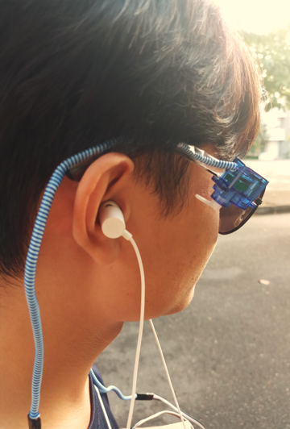
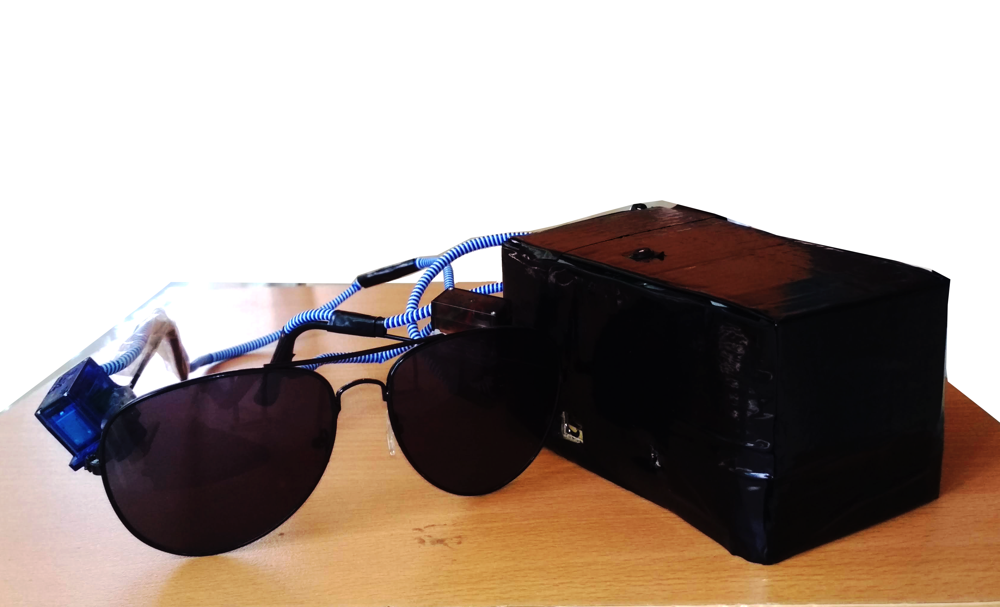
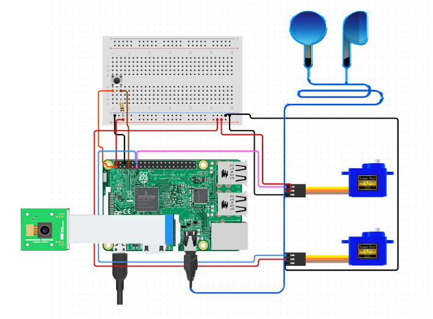
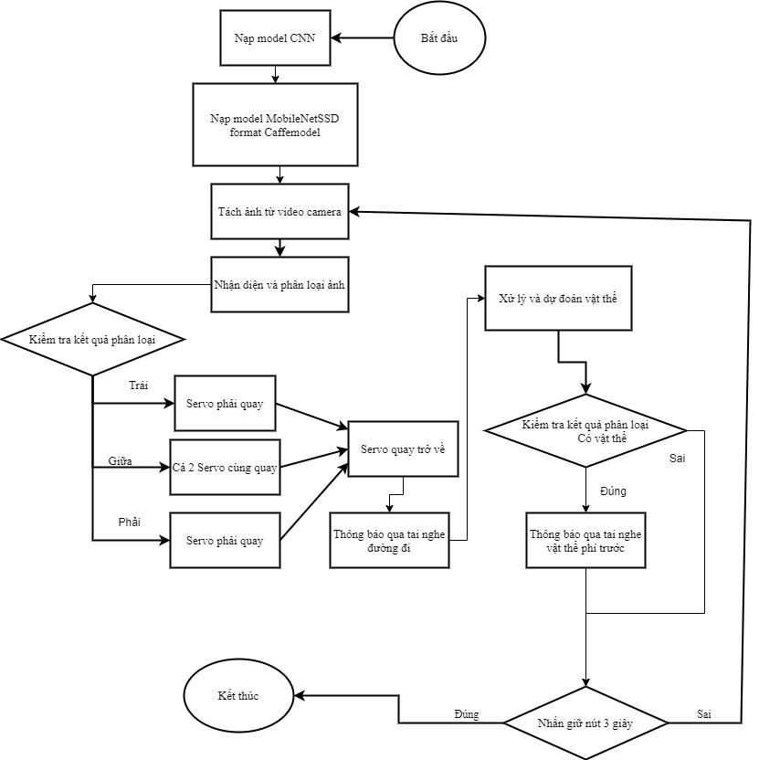
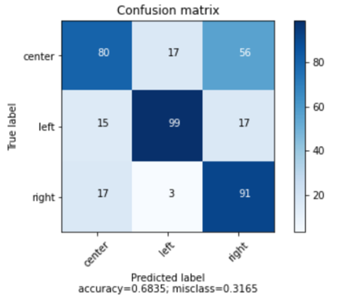

## Thành viên
 1. Phan Văn Vũ – 17T2
 2. Nguyễn Văn Đại – 17T2
 3. Nguyễn Thi Thùy Trinh – 17T2
 4. Đỗ Cao Trí – 17T2

## I. Đặt vấn đề
Đối với người khiếm thị, việc đi lại trên đường còn gặp nhiều khó khăn và nguy hiểm, vì vậy, nhóm đã thiết kế thiết bị kính mắt thông minh dành cho người khiếm thị nhằm đảm bảo an toàn khi di chuyển

### Ý tưởng : Thiết kế **thiết bị mắt kính thông minh cho phép xử lý ảnh từ camera** để
Xác định đường đi bao gồm bên phải/ bên trái và ở giữa đường.
Nhận diện vật thể trên đường: người, xe máy, xe ô tô, …

=> Điều khiển góc quay servo gắn trên kính chạm vào mặt người khiếm thị, đồng thời gửi thông báo âm thanh qua tai nghe.

## Sơ đồ chung

## 
Với mỗi loại đường đi sẽ có những đặc trưng khác nhau

Sử dụng mô hình Convolution Neural Network(CNN) trong Deep Learning với nhiều kernel khác nhau để tìm ra được các đặc trưng đó để phân loại đường đi theo yêu cầu bài toán. 

## Sơ Đồ Thuật  toán

## Kết quả đạt được

## Tài liệu tham khảo
- [0] DeepWay helps the visually impaired navigate with a tap, Arduino team, 2018
Link:https://blog.arduino.cc/2018/08/20/deepway-helps-the-visually-impaired-navigate-with-a-tap/c
- [1] Raspberry Pi: Controlling a Servo from the Raspberry Pi 
Link: https://rpi.science.uoit.ca/lab/servo/, Ngày truy cập: 18/06/2020
- [2] Raspberry Pi: Deep learning object detection with OpenCV by Adrian Rosebrock on October 16, 2017
  -  Link: https://www.pyimagesearch.com/2017/10/16/raspberry-pi-deep-learning-object-detection-with-opencv/ 
    - Link: https://www.pyimagesearch.com/2017/09/11/object-detection-with-deep-learning-and-opencv/
- [3] Sách deep learning cơ bản, Nguyễn Thanh Tuấn, năm 2019
Link: https://nttuan8.com/sach-deep-learning-co-ban/
- [4] Máy Tính Raspberry Pi 3 Model B (Made In UK / PRC)
Link: https://hshop.vn/products/raspberry-pi-3-made-in-uk
/, Ngày truy cập: 20/06/2020.
